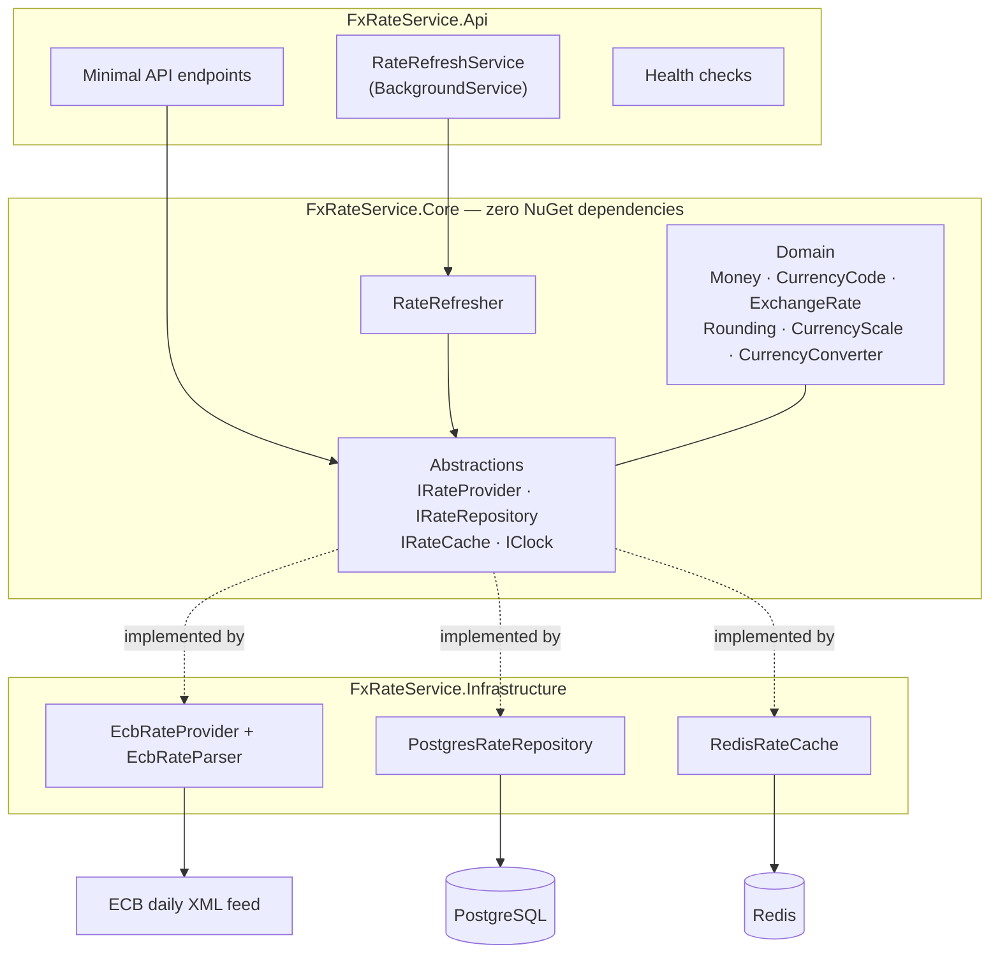
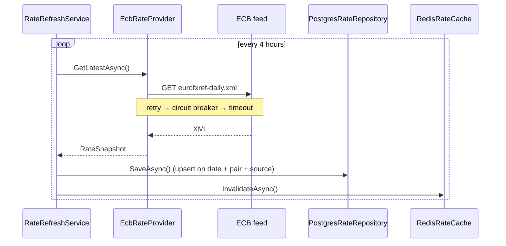
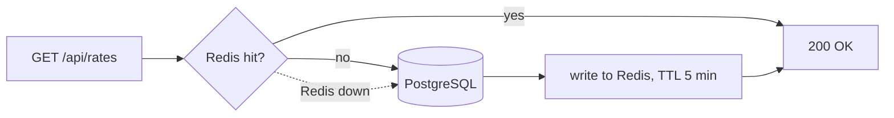

# FX Rate Service

A small .NET service that pulls daily euro reference rates from the European Central Bank, stores their history in PostgreSQL, and exposes an HTTP API for lookup and currency conversion.

The point of the project is not the domain — it is deliberately small. The point is the engineering around it: a domain layer with no infrastructure dependencies, integration tests against real PostgreSQL and Redis via Testcontainers, and a stack that runs with one command.

## Running it

```bash
docker compose up --build
```

That starts PostgreSQL, Redis and the API, applies migrations, and fetches rates on startup.

| | URL |
|---|---|
| API | http://localhost:8081 |
| Health | http://localhost:8081/health |
| PostgreSQL | localhost:5434 |
| Redis | localhost:6380 |

## API

### `GET /api/rates`

Latest published rates. Optional `?currency=USD` filters by quote currency.

```json
{
  "asOf": "2026-08-28",
  "source": "ECB",
  "rates": [
    { "base": "EUR", "quote": "USD", "rate": 1.1643 },
    { "base": "EUR", "quote": "JPY", "rate": 185.92 }
  ]
}
```

Returns `503` when no rates have been loaded yet.

### `GET /api/rates/history`

```
/api/rates/history?baseCurrency=EUR&quote=USD&from=2026-08-01&to=2026-08-31
```

Rates for one pair over a period, ordered by date. Returns `400` for malformed currency codes or an inverted range.

### `POST /api/convert`

```json
{ "amount": 100, "from": "USD", "to": "JPY" }
```

```json
{ "amount": 100, "from": "USD", "result": 15907, "to": "JPY", "asOf": "2026-08-28" }
```

Returns `404` when no rate path exists for the pair, `400` for invalid input.

### `GET /health`

Checks PostgreSQL and Redis connectivity. `200 Healthy` or `503 Unhealthy` — not a liveness stub that always returns OK.

## Architecture



Dependencies point inward. `Core` references nothing — not EF, not HTTP, not even a logging package. That is why its 54 unit tests run in under two seconds with no Docker, no network and no database.

### Refresh cycle



### Read path



Cache-aside. PostgreSQL is the source of truth; Redis is a copy that can disappear without consequence.

## Design decisions

**No MediatR, no CQRS.** Four endpoints and one background job. The indirection would cost more in readability than it buys in structure. The same reasoning applies to the choice of Minimal API over controllers: with thirty endpoints sharing filters and authorization, controllers would be the better fit.

**Domain types are separate from EF entities.** `ExchangeRate` is a `readonly record struct` with a private constructor and validation in `Of`. EF needs a type it can instantiate empty and populate through public setters — which would defeat exactly what the domain type protects. `PostgresRateRepository` is the only class that sees both, and the translation is about twenty lines. The cost is real duplication; the benefit is that the entire domain is testable without a database.

For a CRUD model with no invariants, one shared type would be the right call.

**Money is `decimal`, never `double`.** `double` is binary, so `0.1` cannot be represented exactly and error accumulates across additions. `decimal` is base-10 and exact for any value with up to 28 significant digits.

Division still produces non-terminating values, which is why the rounding rule matters: **intermediate results are never rounded**. A `USD → RSD` conversion goes through EUR at full precision and is rounded exactly once, at the end, to the target currency's scale. There is a test that asserts `1/120` loses precision, precisely so nobody later removes that final rounding.

**Rounding is half-up, in one place.** `Math.Round(x, 2)` without an explicit mode does banker's rounding — a surprise to most readers. `Rounding.ToScale` is the only place in the codebase that rounds money, and the service policy (`MidpointRounding.AwayFromZero`) is a named constant.

**Scale comes from the currency, not from a literal `2`.** JPY and ISK have no minor unit and both appear in the ECB feed; rounding them to two decimals produces an amount that cannot exist. KWD has three.

**Cross rates are derived, not published.** ECB quotes everything against EUR. `USD/JPY` is computed as `EUR/JPY ÷ EUR/USD` — a value ECB never published, and it may differ slightly from another institution's quote for the same pair.

**ECB only.** The `IRateProvider` abstraction exists and a second source would be one class, but there is one implementation today and the README does not pretend otherwise. NBS was dropped deliberately: its official service is SOAP behind credentials, and the time would have gone into authentication rather than into the things this project exists to practice.

**Redis is a cache, and the service survives without it.** A cache over ~30 rates refreshed four times a day does not need a distributed store — `IMemoryCache` would do. Redis is here because it is part of what this project set out to learn, and it is configured honestly: `AbortOnConnectFail = false`, 500 ms timeouts, `BacklogPolicy.FailFast`. With Redis stopped, `/api/rates` still returns `200` from the database — it just gets slower.

Invalidation after each refresh is the primary mechanism; the 5-minute TTL is a safety net for when invalidation fails, not the refresh strategy.

**Configuration is for what varies by environment.** Connection strings and the refresh interval are configurable. The ECB feed URL is a constant — it is the same value everywhere and has been stable for years, and making it configurable would only create a way to break it.

**Central Package Management was added when it solved a problem,** not upfront: the Npgsql provider pins EF Core 10.0.4 while `EntityFrameworkCore.Design` resolved to 10.0.11, producing an assembly conflict. Versions now live in one file with a comment explaining why those two are tied together.

**Migrations on startup are behind a flag.** Convenient for Compose and demos; questionable in production, where two instances race and a failed migration takes down startup. `RunMigrationsOnStartup` defaults to `false`, and a real deployment would run migrations as a separate pipeline step.

## Testing

```bash
dotnet test tests/FxRateService.UnitTests          # 54, ~2s, no Docker
dotnet test tests/FxRateService.IntegrationTests   # 14, needs Docker
```

**Unit tests** cover the domain, the ECB XML parser (against a recorded feed as an embedded resource), and the resilience pipeline. Nothing leaves the process — the HTTP layer is replaced with a stub `HttpMessageHandler`, which also makes it possible to assert that a retry really issued three requests.

**Integration tests** run against real PostgreSQL and Redis containers started from code. Not the EF in-memory provider: it has no `numeric(18,6)`, does not enforce unique indexes the same way, and knows nothing about `timestamptz` — testing against it would mean testing the things that don't exist in production.

What that buys, concretely: proof that `0.85613` survives a round trip through `numeric(18,6)`, that the unique index rejects duplicates at the database level, that the upsert updates instead of failing on a second refresh for the same day, and that the migrations apply cleanly to an empty database.

API tests use `WebApplicationFactory`, booting the whole service in memory with real containers behind it and a fake `IRateProvider` in front. Those catch what the other layers cannot: routing, JSON serialization, status codes, and whether the DI container can actually construct everything.

## Known limitations

- **No distributed lock.** Two API instances would both run the refresh job and race on the same rows. The unique index turns that into a loud failure rather than duplicate data, but the right fix is a Redis lock with `SET NX PX` and ownership-checked release.
- **Redis degradation is still noticeable.** Fail-fast brought a request with Redis down from ~11 s to well under a second, but each request still pays a connection attempt. A circuit breaker around the cache — the same pattern already used for the ECB client — would remove that.
- **No authentication or rate limiting.** The API is open.
- **`POST /api/convert` duplicates the cache-aside block** from the rates endpoint. It wants a small abstraction that tries the cache and falls back to the repository.
- **Rates are only as fresh as the last cycle.** ECB publishes around 15:00 CET on TARGET working days; a four-hour interval means the first cycles of a day serve the previous day's rates.

## Stack

.NET 10 · ASP.NET Core Minimal API · EF Core + Npgsql · PostgreSQL 17 · Redis 7 · Polly (via `Microsoft.Extensions.Http.Resilience`) · Serilog · xUnit v3 · Testcontainers · Docker Compose · GitHub Actions